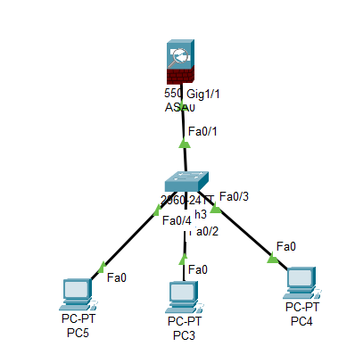

# 🔥 DHCP Configuration with Cisco ASA Firewall

<div align="center">


**Network security implementation with DHCP server and ASA Firewall**

[View Topology](#-network-topology) • [CLI Guide](#-asa-firewall-configuration) • [Documentation](#)

</div>

---

## 📋 Overview

Project ini mendemonstrasikan konfigurasi DHCP server yang terintegrasi dengan Cisco ASA (Adaptive Security Appliance) Firewall untuk memberikan IP address secara otomatis sambil mempertahankan keamanan jaringan melalui security policies dan access control.

---

## 🖼️ Network Topology

<div align="center">
  
  <p><em>Network topology dengan DHCP server dan ASA Firewall implementation</em></p>
</div>

---

## 💻 CLI Configuration

<div align="center">
  
  <p><em>ASA Firewall dan DHCP configuration commands</em></p>
</div>

---

## 🏗️ Architecture Components

### Network Devices
- **Cisco ASA 5505** - Adaptive Security Appliance Firewall
- **Layer 2 Switch** - Internal network connectivity
- **Router/DHCP Server** - IP address distribution
- **End Devices** - Client workstations

### Security Zones
```
┌─────────────────────────────────────────┐
│         OUTSIDE (Internet)              │
│         Security Level: 0               │
└──────────────┬──────────────────────────┘
               │
        ┌──────▼───────┐
        │  ASA Firewall │
        │  (Security)   │
        └──────┬───────┘
               │
┌──────────────▼──────────────────────────┐
│         INSIDE (LAN)                    │
│         Security Level: 100             │
│         DHCP Pool: 192.168.1.0/24       │
└─────────────────────────────────────────┘
```

---

## 🔧 DHCP Configuration

### DHCP Pool Setup on Router

```cisco
Router> enable
Router# configure terminal
Router(config)# ip dhcp pool LAN_POOL

# Define network and subnet
Router(dhcp-config)# network 192.168.1.0 255.255.255.0

# Set default gateway
Router(dhcp-config)# default-router 192.168.1.1

# Configure DNS server
Router(dhcp-config)# dns-server 8.8.8.8 8.8.4.4

# Set lease time (optional)
Router(dhcp-config)# lease 7

# Exit DHCP config
Router(dhcp-config)# exit

# Exclude addresses (gateway, servers, firewall)
Router(config)# ip dhcp excluded-address 192.168.1.1 192.168.1.10

Router(config)# exit
Router# write memory
```

---

## 🛡️ ASA Firewall Configuration

### Basic ASA Setup

```cisco
ciscoasa> enable
ciscoasa# configure terminal

# Configure hostname
ciscoasa(config)# hostname ASA-FW

# Configure inside interface
ASA-FW(config)# interface gigabitEthernet 0/0
ASA-FW(config-if)# nameif inside
ASA-FW(config-if)# security-level 100
ASA-FW(config-if)# ip address 192.168.1.254 255.255.255.0
ASA-FW(config-if)# no shutdown
ASA-FW(config-if)# exit

# Configure outside interface
ASA-FW(config)# interface gigabitEthernet 0/1
ASA-FW(config-if)# nameif outside
ASA-FW(config-if)# security-level 0
ASA-FW(config-if)# ip address dhcp setroute
ASA-FW(config-if)# no shutdown
ASA-FW(config-if)# exit
```

### DHCP Relay Configuration (if needed)

```cisco
# Enable DHCP relay on ASA
ASA-FW(config)# dhcprelay server 192.168.1.1 inside
ASA-FW(config)# dhcprelay enable inside
ASA-FW(config)# dhcprelay timeout 60
```

### NAT Configuration

```cisco
# Configure NAT for inside network
ASA-FW(config)# object network INSIDE_NET
ASA-FW(config-network-object)# subnet 192.168.1.0 255.255.255.0
ASA-FW(config-network-object)# nat (inside,outside) dynamic interface
ASA-FW(config-network-object)# exit
```

### Access Control List (ACL)

```cisco
# Allow inside to outside traffic
ASA-FW(config)# access-list INSIDE_IN extended permit ip any any
ASA-FW(config)# access-group INSIDE_IN in interface inside

# Block specific traffic (example)
ASA-FW(config)# access-list OUTSIDE_IN extended deny ip any any
ASA-FW(config)# access-group OUTSIDE_IN in interface outside
```

### Enable ICMP (for testing)

```cisco
# Allow ping from inside
ASA-FW(config)# icmp permit any inside

# Allow ping to outside (for testing)
ASA-FW(config)# icmp permit any outside
```

---

## 🔍 Verification Commands

### Verify DHCP on Router

```cisco
# Show DHCP pool configuration
Router# show ip dhcp pool

# Show DHCP bindings (leased IPs)
Router# show ip dhcp binding

# Show DHCP server statistics
Router# show ip dhcp server statistics

# Show excluded addresses
Router# show ip dhcp excluded-address
```

### Verify ASA Configuration

```cisco
# Show interface configuration
ASA-FW# show interface ip brief

# Show NAT configuration
ASA-FW# show nat

# Show access-lists
ASA-FW# show access-list

# Show DHCP relay info
ASA-FW# show dhcprelay statistics

# Show running configuration
ASA-FW# show running-config
```

### Client-Side Testing

```cisco
# On Windows PC
C:\> ipconfig /release
C:\> ipconfig /renew
C:\> ipconfig /all

# On Cisco device
PC> ip dhcp
PC> show ip

# Test connectivity
PC> ping 192.168.1.1
PC> ping 8.8.8.8
```

---

## 📊 Network Specifications

| Parameter | Value |
|-----------|-------|
| **Inside Network** | 192.168.1.0/24 |
| **DHCP Range** | 192.168.1.11 - 192.168.1.254 |
| **Gateway** | 192.168.1.1 |
| **DNS Server** | 8.8.8.8, 8.8.4.4 |
| **ASA Inside IP** | 192.168.1.254 |
| **Lease Time** | 7 days |
| **Security Level (Inside)** | 100 |
| **Security Level (Outside)** | 0 |

---

## 🎯 Key Features

✅ **Automatic IP Assignment** - DHCP server distributes IPs otomatis  
🔒 **Firewall Protection** - ASA firewall melindungi internal network  
🌐 **NAT Translation** - Inside network dapat akses internet  
📡 **DHCP Relay** - Forward DHCP requests antar subnet  
🛡️ **Access Control** - ACL mengontrol traffic flow  
⚡ **Security Zones** - Separasi inside/outside network

---

## 🚨 Security Best Practices

### ASA Firewall Security

1. **Change Default Passwords**
   ```cisco
   ASA-FW(config)# enable password <strong-password>
   ASA-FW(config)# username admin password <admin-password> privilege 15
   ```

2. **Configure SSH Access**
   ```cisco
   ASA-FW(config)# crypto key generate rsa modulus 2048
   ASA-FW(config)# ssh 192.168.1.0 255.255.255.0 inside
   ASA-FW(config)# ssh timeout 30
   ```

3. **Enable Logging**
   ```cisco
   ASA-FW(config)# logging enable
   ASA-FW(config)# logging buffered informational
   ```

4. **Configure Time-based ACLs**
   ```cisco
   ASA-FW(config)# time-range BUSINESS_HOURS
   ASA-FW(config-time-range)# periodic weekdays 08:00 to 18:00
   ```

---

## 🧪 Troubleshooting

### DHCP Issues

**Problem: Client not getting IP address**
```cisco
# Check DHCP pool
Router# show ip dhcp pool

# Verify pool not exhausted
Router# show ip dhcp binding

# Check excluded addresses
Router# show ip dhcp excluded-address

# Enable DHCP debugging
Router# debug ip dhcp server events
```

**Problem: Wrong gateway assigned**
```cisco
# Verify default-router configuration
Router(dhcp-config)# default-router 192.168.1.1
```

### ASA Firewall Issues

**Problem: Traffic blocked by firewall**
```cisco
# Check NAT translation
ASA-FW# show nat detail

# Verify access-list
ASA-FW# show access-list

# Check interface status
ASA-FW# show interface ip brief

# Enable packet tracer
ASA-FW# packet-tracer input inside icmp 192.168.1.10 8 0 8.8.8.8
```

**Problem: Cannot ping through firewall**
```cisco
# Enable ICMP
ASA-FW(config)# icmp permit any inside
ASA-FW(config)# icmp permit any outside

# Check security levels
ASA-FW# show nameif
```

---

## 📁 Project Files

```
dhcp-asa-firewall/
├── assets/
│   ├── cisco.pkt          # Packet Tracer file
│   └── topology.png       # Network topology diagram
├── configs/
│   ├── router-config.txt  # Router DHCP configuration
│   └── asa-config.txt     # ASA firewall configuration
└── README.md
```

---

## 🎓 Learning Objectives

- ✅ DHCP server configuration
- ✅ DHCP pool management
- ✅ ASA Firewall basic setup
- ✅ Security zone implementation
- ✅ NAT configuration
- ✅ Access Control Lists (ACL)
- ✅ Network troubleshooting
- ✅ Security policy enforcement

---

## 🚀 Advanced Topics

<details>
<summary><b>🔐 VPN Configuration</b></summary>

Configure site-to-site VPN on ASA for secure remote access.
```cisco
ASA-FW(config)# crypto ikev1 enable outside
ASA-FW(config)# crypto ikev1 policy 10
```
</details>

<details>
<summary><b>🌐 Multiple DHCP Pools</b></summary>

Create separate DHCP pools for different VLANs or departments.
```cisco
Router(config)# ip dhcp pool VLAN10
Router(dhcp-config)# network 192.168.10.0 255.255.255.0
```
</details>

<details>
<summary><b>📊 DHCP Snooping</b></summary>

Implement DHCP snooping on switches for security.
```cisco
Switch(config)# ip dhcp snooping
Switch(config)# ip dhcp snooping vlan 10
```
</details>

---

## 🤝 Contributing

Contributions are welcome! Please:

1. Fork the repository
2. Create feature branch (`git checkout -b feature/Enhancement`)
3. Commit changes (`git commit -m 'Add new security feature'`)
4. Push to branch (`git push origin feature/Enhancement`)
5. Open Pull Request

---

## 📄 License

This project is licensed under the MIT License.

---

## 👨‍💻 Author

**renaiy0**

📧 Questions? Open an issue!  
⭐ Found this helpful? Star the repo!  
🔗 Share with network engineers!

---

<div align="center">

**Securing Networks with ASA Firewall** 🔥

*Building secure, automated network infrastructure*

</div>
